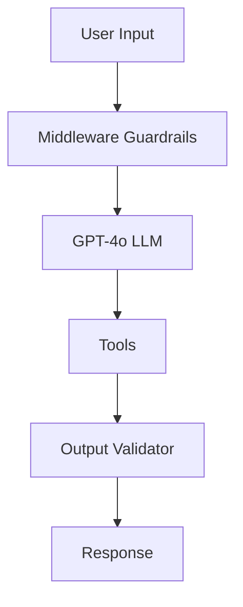

# 🏥 Healthcare AI Agent with Guardrails

A production-style **Healthcare AI Assistant** built using **LangChain, LangGraph, and GPT-4o**, designed with strong focus on **safety, privacy, and human oversight**.

This project demonstrates how to build a **real-world AI agent system** with tools, middleware guardrails, and controlled execution flow.

---

## 🚀 Features

- 💬 AI-powered healthcare assistant (GPT-4o)
- 🧠 Symptom analysis using tools
- 💊 Medication information retrieval
- 📅 Doctor appointment booking system
- 🛡️ Safety filters for harmful queries
- 🔒 PII protection (email & credit card masking)
- 👨‍⚕️ Human-in-the-loop approval for sensitive actions
- 📜 Automatic medical disclaimers on all outputs
- 🧵 Session-based memory (threaded conversations)

---

## 🏗️ System Architecture

---

## 🔄 Workflow

User Input
↓
Safety Middleware
↓
PII Redaction
↓
LLM Decision (GPT-4o)
↓
Tool Execution (if needed)
↓
Human Approval (if required)
↓
Output Validation
↓
Final Response

---

## 🧰 Tools Used

### 1. Symptom Search
Provides general symptom information.

### 2. Medication Info
Returns safe medication guidance.

### 3. Appointment Booking
Schedules doctor appointments (requires approval).

---

## 🛡️ Guardrails (Safety Layer)

This system includes multiple protection layers:

- 🚫 Blocks unsafe or irrelevant queries  
- 🔐 Removes sensitive personal data  
- 👨‍⚕️ Requires human approval for critical actions  
- 📜 Ensures medical disclaimer is always included  

---

## 🧠 Middleware System

- `HealthcareSafetyFilter` → blocks harmful requests  
- `PIIMiddleware` → protects user privacy  
- `HumanInTheLoopMiddleware` → approval system  
- `MedicalOutputValidator` → ensures safe output formatting  

---

## 💾 Memory System

Uses **thread-based memory (InMemorySaver)** to maintain conversation context across sessions.

---

## 🧪 Example Use Cases

### 🔹 Symptom Check

User: What are symptoms of diabetes?
AI: Returns structured medical information + disclaimer

### 🔹 Appointment Booking

User: Book appointment with Dr. Sharma
System: Pauses → waits for human approval → executes booking

---

## ⚙️ Tech Stack

- Python 🐍
- LangChain 🧠
- LangGraph 🔗
- OpenAI GPT-4o 🤖
- Middleware Architecture 🛡️

---

## 🎯 Key Highlights

- Production-style agent design
- Real-world healthcare safety constraints
- Human-controlled automation
- Modular and scalable architecture

---

## 🚧 Future Improvements

- Real hospital API integration
- Web dashboard for approvals
- Advanced AI safety classifier
- Deployment using FastAPI + React frontend

---

## 📌 Author

Built as an AI Engineering + Agentic AI learning project.

---

## ⭐ Outcome

This project demonstrates how to build a **safe, explainable, and production-ready AI agent system** for real-world healthcare applications.
